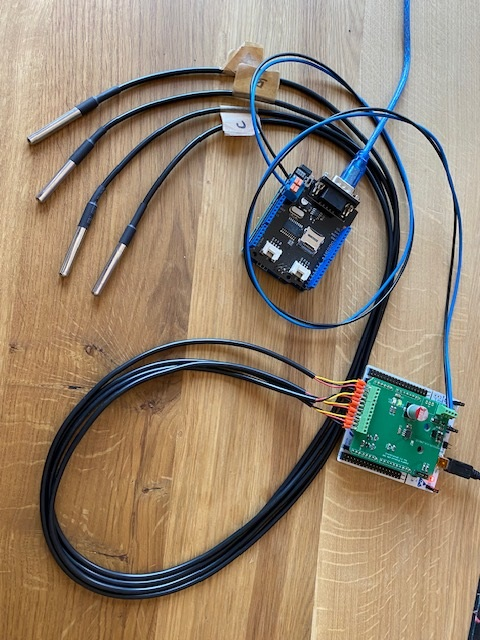
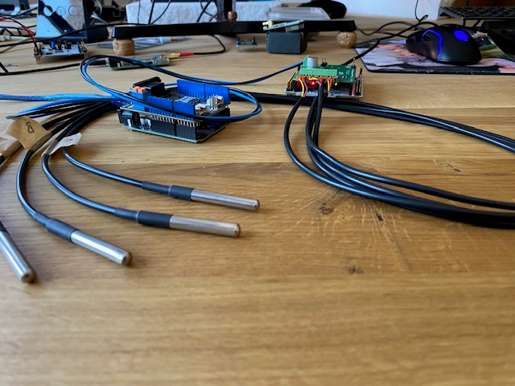
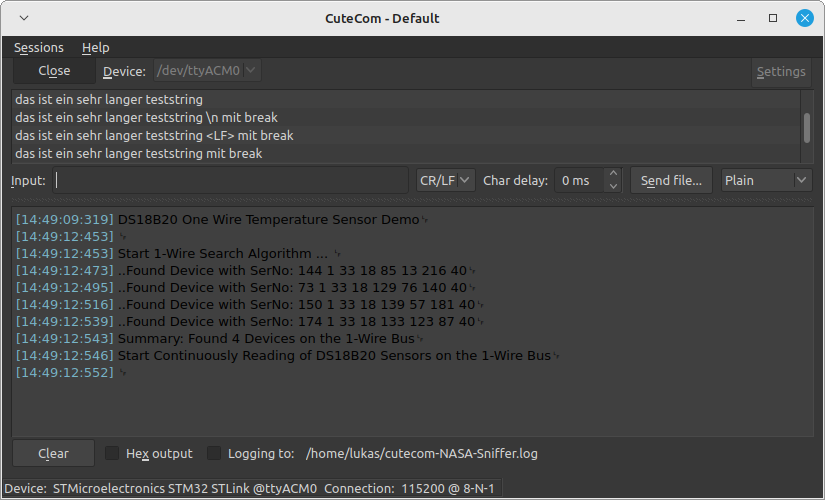
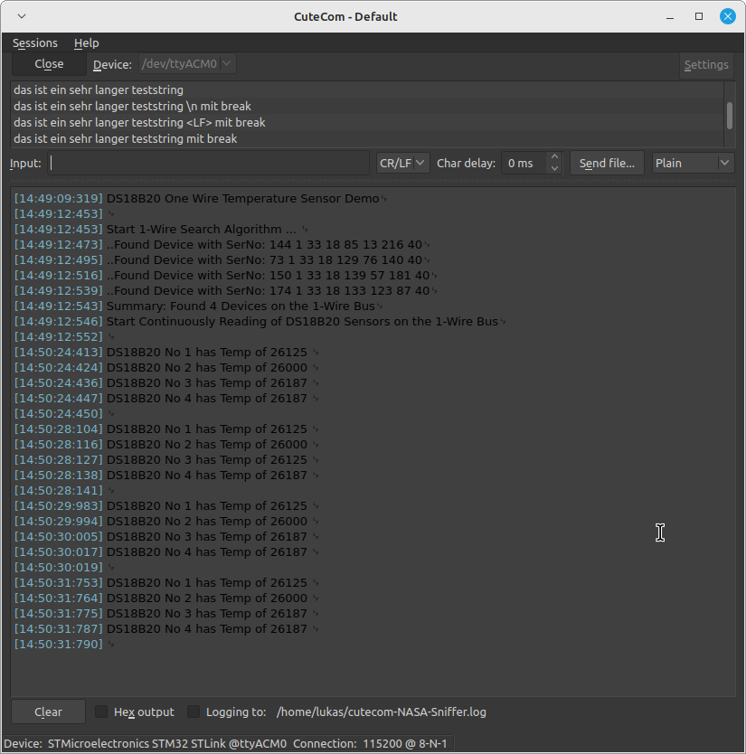
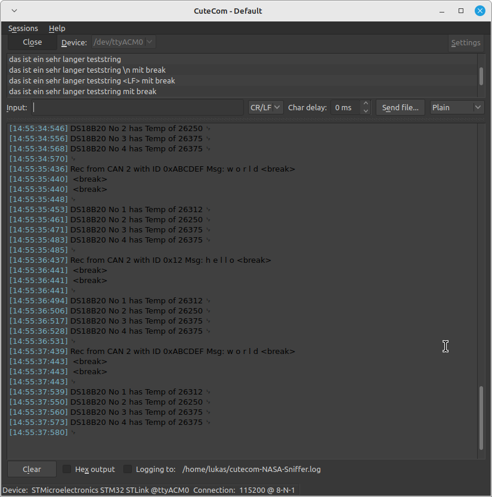
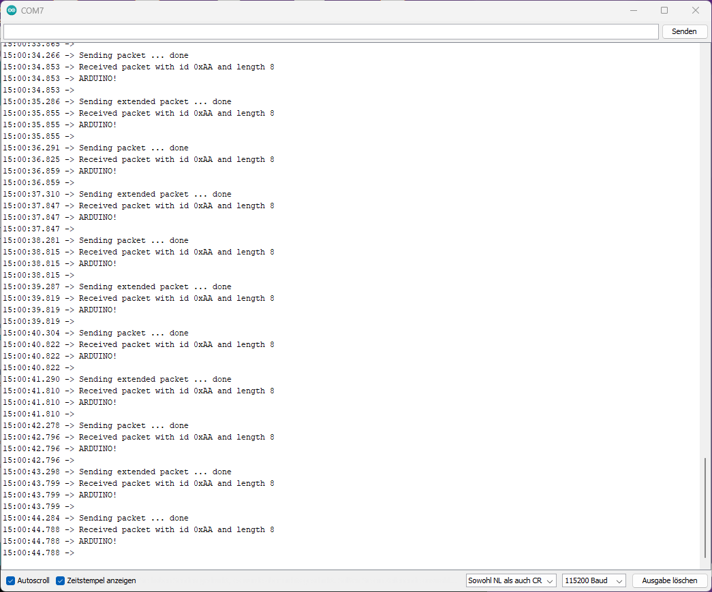

# Testing
Because of lacking a proper CAN-Testing-Tool like this [PCAN-USB](https://www.peak-system.com/PCAN-USB.199.0.html?&L=1) I just used a Arduino with CAN-Shield and a minimal Arduino Sketch.
The Arduino program sends periodic test messages and receives CAN-messages from the Nucleo Board. With this I could ensure CAN (especially the CAN transceiver IC) works both directions.

## Hardware
todo

## Software
todo

## CAN-Bus
todo